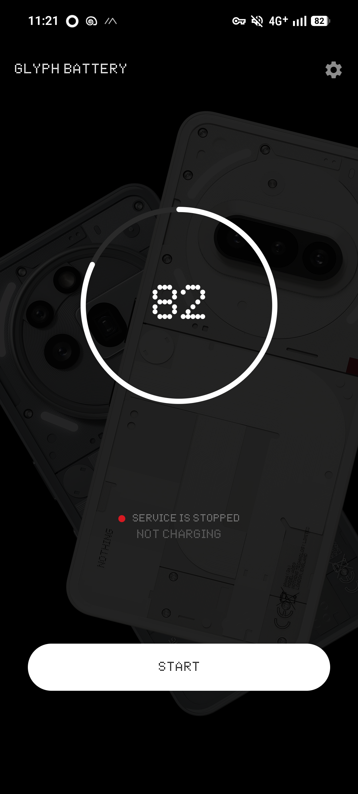
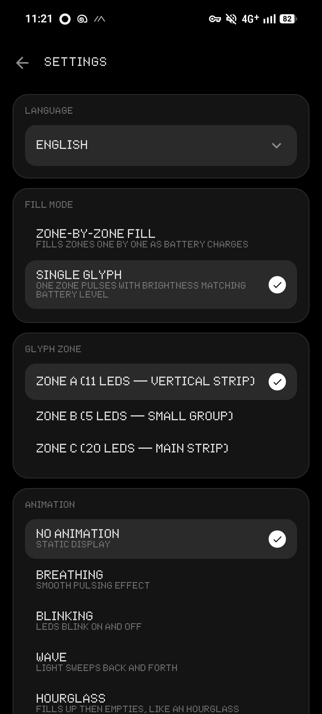
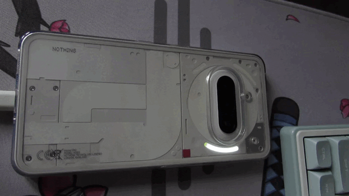

# Glyph Battery

Your Nothing Phone's Glyph LEDs show battery level in real time.

  
demo

  

    
    
    

  

## What it does

The app lights up Glyph LEDs on the back of your Nothing Phone to show how much battery you have left. The more charge — the more LEDs are lit.

## Features

- **Fill modes** — fill zones one by one, or use a single zone
- **Animations** — Breathing, Blinking, Wave, Hourglass, Smooth Fill
- **Brightness & speed** — fully adjustable
- **Auto-off timer** — LEDs turn off after a set time
- **Full charge action** — choose what happens at 100%
- **Service modes:**
  - **Manual** — tap to start, tap to stop
  - **Always On** — starts automatically after reboot
  - **Charging Only** — works only while plugged in
- **Languages** — English, Russian

## Compatibility

- Nothing Phone 3a/3a pro
- Nothing os(Custom systems with glyph support should theoretically work)

[Русская версия](README_RU.md)
